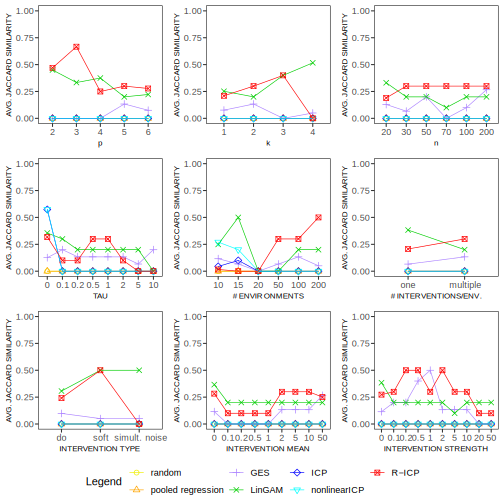

# Invariant Causal Prediction under Random Effects (R-ICP)

This repository contains the code to reproduce the results from the first part of my master thesis. This is an extension of the method [Invariant Causal Prediction (ICP)](https://www.jstor.org/stable/44682904) where the causal effect is still linear and is allowed to vary (randomly) from environment to environment. 

## Reproducing experiments

To compare RICP against existing causal discovery methods using the default
settings, run in the terminal:

```
Rscript sims/simulation_comparisonOfMethods.R
```

The following arguments can be changed in the R script: 

- `p`: The number of nodes the DAG should contain. Default is `4`.
- `k`: The averge number of edges each node in the DAG contains. Default is `2`. 
- `nenv`: The number of environments corresponding to the number of interventions + 1 (observational data). Note that selecting too few environments might result in an error because a node can contain no data where it was not intervened on. Default is `5`. 
- `renv` Vector that contains two elements: The minimal and maximal number of observations per subenvironment. Default is `c(80, 100)`.
- `rBeta`: Contains two elements: The minimal and maximal bounds from which to unifromly sample beta from. Default is `c(-5, 5)`. 
- `tau`: The variance parameter of the random effects. This parameter specifies how much we allow the causal effect to vary from environment to environment. Default is `0.5`. 
-  `nInter`: If "one" (default) then only one predictor variable per environment is being intervened on. If "multiple" the intervention is on multiple predictors in the same environment. The number of interventions is either one (w/ probability 1/6) or multiple (w/ probability 5/6). The number of multiple interventions is sampled uniformly from '1:(p-2)'. 
- `interType`: Choose from 'do', 'soft', simultaneous-noise' or 'relaxed-do'. Default is `do`. 
- `interMean`: This corresponds to the mean of the intervention. For each intervention we sample the mean from 'interMean'. Default is `2`. 
- `interStrength`: This corresponds to the strength of the intervention. For each intervention we sample the strength from 'interStrength' and pre-multiply the intervention with it. Default is `c(0, 0.1, 0.2, 0.5, 1, 2, 5, 10)`. 
- `subenvs`: If TRUE then the RICP algorithm for subenvironments is used. Otherwise, we compare the data from the observational distribution against all the interventional distributions using (corrected) confidence interval. This approach has shown to have little to no power in practice. Default is `TRUE`. 
- `nsubenvs`: Each subenvironment corresponds to a realization of the random effect within an environment. If 'nsubenvs' is an integer, then each environment contains an equal number of subenvironments. Otherwise, each list element contains a vector with the number of subenvironments per environment. Default is 'NULL' corresponding to no subenvironments. 
- `methods`: The methods for which the causal discovery algorithm should be run. Choose from 'random', 'pooled regression', 'GES', 'LinGAM', 'ICP', 'nonlinearICP' and 'RICP'. 

The output of the Rscript is twofold: 
 - A file `scores_comparison-of-methods.RData` containing all computed metrics from the simulation is saved in `res/`. The metrics include `FWER`, `success probability` and `average Jaccard similarity`. 
 - Plots displaying the 3 mentioned metrics for each methods are saved in `fig/`.

 Any other experiment that was performed can also be found in the `sims` folder. For example, investigating the effect of `tau` can be done by running in the terminal (or RStudio). 
 
 ```
Rscript sims/simulation_tau.R
```

 For example, an overview of all the analyzed effects showing the jaccard similarity is
 
<p align="center">  
    
</p>  

## Additional information

Although the code does not come in a nice R-package, it is written as if it was in one. If at any point in the future, somebody decides to create a R-package, it should be possible without a big effort. 
## Feedback

Constructive feedback is more than welcome. Do not hesitate to reach me at [email](mailto:schwarbf@student.ethz.ch).
